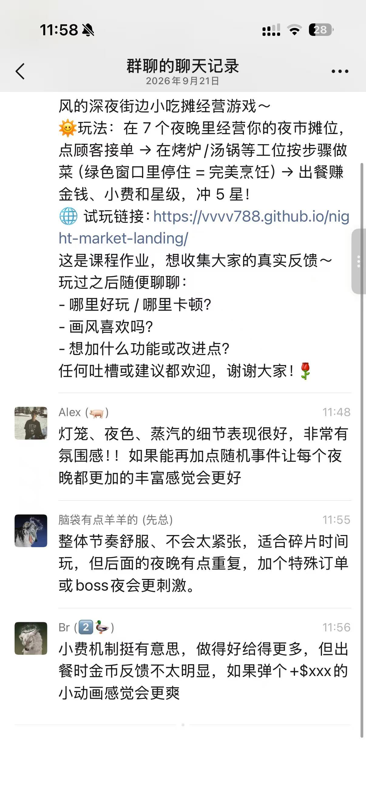
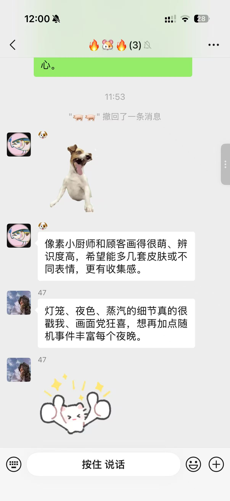
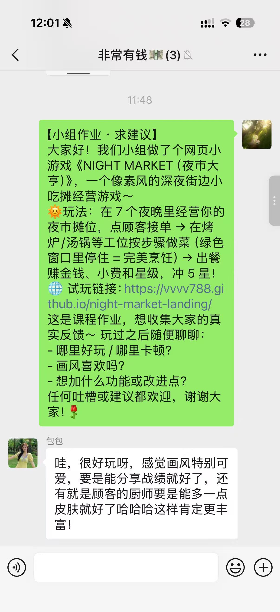
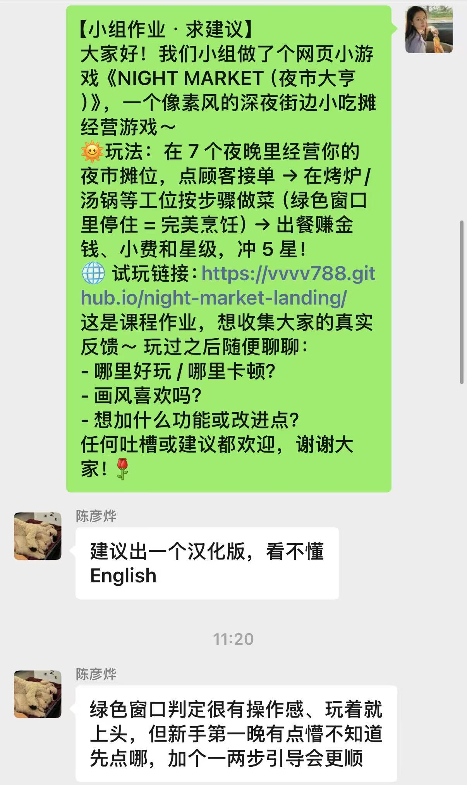
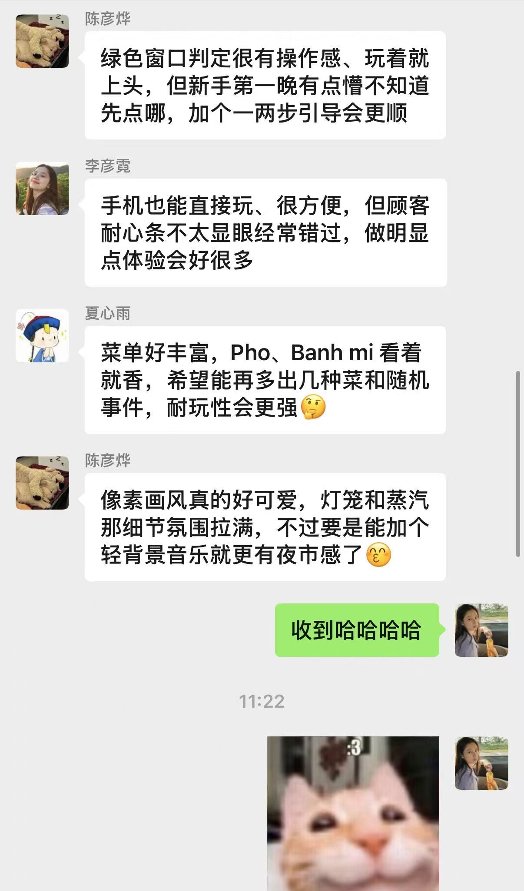
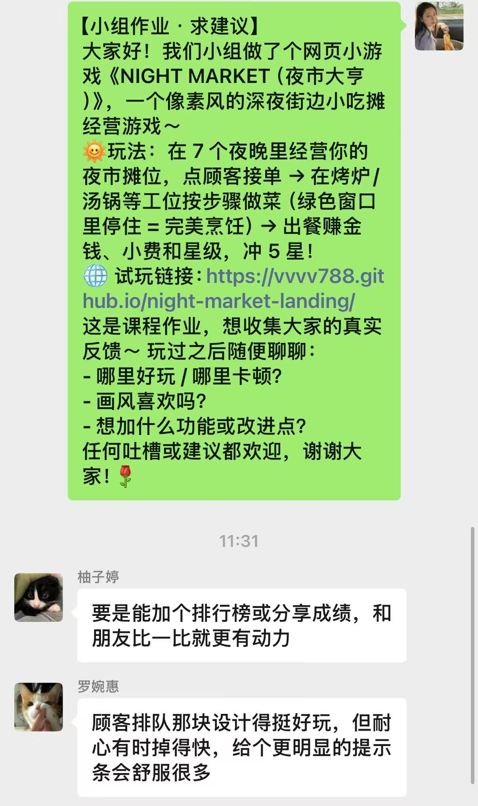

# 《NIGHT MARKET（夜市大亨）》玩家反馈收集报告

- **组名 / Group**：thu-messy-kitchen
- **游戏 / Game**：NIGHT MARKET（夜市大亨）
- **报告日期 / Date**：2026 年 9 月 21 日
- **游戏部署链接 / Game**：https://ndbac.github.io/thu-messy-kitchen/
- **落地页 / Landing Page**：https://vvvv788.github.io/night-market-landing/

---

## 一、反馈收集概况

| 项目 | 内容 |
| --- | --- |
| 收集渠道 | 微信群（多个同学群 / 朋友群） |
| 收集方式 | 群内发布游戏介绍文案 + 试玩链接，邀请大家试玩后留言提意见 |
| 收集时间 | 2026 年 9 月 21 日 11:20 – 12:01 |
| 反馈人数 | 11 位群友 |
| 有效反馈 | 13 条 |
| 反馈构成 | 每条均包含正面评价；其中 11 条同时提出改进建议，2 条为纯功能请求 |
| Bug 报告 | 无明确 Bug 反馈（游戏可正常试玩） |

**收集话术（群发原文）**：

> 【小组作业 · 求建议】大家好！我们小组做了个网页小游戏《NIGHT MARKET（夜市大亨）》，一个像素风的深夜街边小吃摊经营游戏～ 玩法：在 7 个夜晚里经营你的夜市摊位，点顾客接单 → 在烤炉/汤锅等工位按步骤做菜（绿色窗口里停住 = 完美烹饪）→ 出餐赚金钱、小费和星级，冲 5 星！这是课程作业，想收集大家的真实反馈～ 任何吐槽或建议都欢迎！

---

## 二、反馈明细整理

> 每条反馈均为群友原话摘录（未改动），并标注类别。

| # | 反馈人 | 反馈内容（原话摘录） | 类别 |
| --- | --- | --- | --- |
| 1 | 群友 | 灯笼、夜色、蒸汽的细节表现很好，非常有氛围感！！如果能再加点随机事件让每个夜晚都更加的丰富感觉得会更好 | 🟢夸奖 + 🟡功能 |
| 2 | 群友 | 整体节奏舒服、不会太紧张，适合碎片时间玩，但后面的夜晚有点重复，加个特殊订单或 boss 夜会更刺激 | 🟢夸奖 + 🟡功能 |
| 3 | 群友 | 小费机制挺有意思，做得好给得更多，但出餐时金币反馈不太明显，如果弹个 +$xxx 的小动画感觉会更爽 | 🟢夸奖 + 🔵体验 |
| 4 | 群友 | 像素小厨师和顾客画得很萌、辨识度高，希望能多几套皮肤或不同表情，更有收集感 | 🟢夸奖 + 🟡功能 |
| 5 | 群友 | 灯笼、夜色、蒸汽的细节真的很戳我、画面党狂喜，想再加点随机事件丰富每个夜晚 | 🟢夸奖 + 🟡功能 |
| 6 | 群友 | 哇，很好玩呀，感觉画风特别可爱，要是能分享战绩就好了，还有就是顾客的厨师要是能多一点皮肤就好了哈哈哈这样肯定更丰富 | 🟢夸奖 + 🟡功能 |
| 7 | 群友 | 建议出一个汉化版，看不懂 English | 🟡功能 |
| 8 | 群友 | 绿色窗口判定很有操作感、玩着就上头，但新手第一晚有点懵不知道先点哪，加个一两步引导会更顺 | 🟢夸奖 + 🔵体验 |
| 9 | 群友 | 手机也能直接玩、很方便，但顾客耐心条不太显眼经常错过，做明显点体验会好很多 | 🟢夸奖 + 🔵体验 |
| 10 | 群友 | 菜单好丰富，Pho、Banh mi 看着就香，希望能再多出几种菜和随机事件，耐玩性会更强 | 🟢夸奖 + 🟡功能 |
| 11 | 群友 | 像素画风真的好可爱，灯笼和蒸汽那细节氛围拉满，不过要是能加个轻背景音乐就更夜市感了 | 🟢夸奖 + 🟡功能 |
| 12 | 群友 | 要是能加个排行榜或分享成绩，和朋友比一比就更有动力 | 🟡功能 |
| 13 | 群友 | 顾客排队那块设计得挺好玩，但耐心有时掉得快，给个更明显的提示条会舒服很多 | 🟢夸奖 + 🔵体验 |

---

## 三、反馈主题分析

### 3.1 好评集中在哪（🟢，13/13 条含正面评价）

| 好评主题 | 提及次数 | 代表反馈 |
| --- | --- | --- |
| 像素画风 / 夜市氛围（灯笼、夜色、蒸汽） | **5** | 见 #1、#5、#11、#6、#4 |
| 玩法有趣 / 操作上头（绿色窗口、排队、小费） | **4** | 见 #8、#3、#13、#2 |
| 节奏舒适、适合碎片时间 | 1 | 见 #2 |
| 菜单丰富 / 跨平台可玩 | 2 | 见 #10、#9 |

**结论**：美术氛围是本作最强记忆点（5/11 人主动提及）；核心玩法循环（接单→烹饪→出餐）被普遍认为有操作感、不无聊。

### 3.2 建议集中在哪（🔵 体验 + 🟡 功能，13 条中 11 条含建议）

| 建议主题 | 提及次数 | 优先级建议 | 对应反馈 |
| --- | --- | --- | --- |
| **增加随机事件 / 更多内容（菜品、boss 夜、特殊订单）** | **3** | 高 | #1、#5、#10（另有 #2 类似） |
| 耐心条更明显 / 快掉时强提示 | **2** | 高（低成本） | #9、#13 |
| 角色皮肤 / 表情系统 | **2** | 中 | #4、#6 |
| 排行榜 / 战绩分享 | **2** | 中 | #6、#12 |
| 背景音乐（BGM） | **1** | 高（呼声强、成本低） | #11 |
| 出餐金币反馈动画（+$xx） | **1** | 高（低成本） | #3 |
| 新手引导（第一晚不知道先点哪） | **1** | 高 | #8 |
| 汉化版 / 中文界面 | **1** | 高（影响部分玩家上手） | #7 |
| 后期夜晚重复感 | **1** | 中 | #2 |

### 3.3 值得注意的观察

- **无 Bug 反馈**：13 条反馈中没有人报告游戏崩溃或无法试玩，说明当前部署版本基本稳定。
- **链接口径问题**：群发时用的是 Landing Page 链接而非游戏直链，群友需从落地页二次跳转。建议后续宣传时直接附游戏部署链接，降低流失。
- **汉化诉求真实存在**：有反馈者明确表示「看不懂 English」影响了体验，中文界面（i18n）应尽早列入计划。

---

## 四、结论与改进行动

**总体结论**：本次共收集 13 条反馈，全部为正面或建设性意见，无差评、无崩溃报告。玩家对像素美术与核心玩法认可度高；改进建议集中在「内容丰富度、引导与反馈可见性、音频、汉化」四个方向。

**改进行动清单（按优先级）**：

| 优先级 | 行动 | 依据反馈 |
| --- | --- | --- |
| P0（下次迭代即做） | ① 新手引导（第 1 晚两步提示强化）② 耐心条临近耗尽时闪烁/变色 ③ 出餐时 +$xx 金币飘字 | #8、#9、#13、#3 |
| P1（短期规划） | ④ 增加轻量 BGM ⑤ 中文界面（i18n）⑥ 排行榜 / 战绩分享 | #11、#7、#6、#12 |
| P2（版本迭代） | ⑦ 新随机事件与特殊订单 / boss 夜 ⑧ 新菜品 ⑨ 厨师与顾客皮肤系统 | #1、#5、#10、#2、#4、#6 |

---

## 五、附录：反馈原始截图

以下 6 张截图为微信群反馈的原始聊天记录（与本报告第二部分明细一一对应）：

| 附录编号 | 内容对应 | 文件 |
| --- | --- | --- |
| 附录 1 | 群聊聊天记录：#1–#3 反馈 | `appendix/appendix-01.jpg` |
| 附录 2 | #4–#5 反馈 | `appendix/appendix-02.jpg` |
| 附录 3 | 群：群发文案 + #6 反馈 | `appendix/appendix-03.jpg` |
| 附录 4 | 群发文案 + #7–#8 反馈 | `appendix/appendix-04.jpg` |
| 附录 5 | #9–#11 反馈 | `appendix/appendix-05.jpg` |
| 附录 6 | #12–#13 反馈 | `appendix/appendix-06.jpg` |

---

*报告由 thu-messy-kitchen 小组整理 · NIGHT MARKET（夜市大亨）· 2026-09-21*
