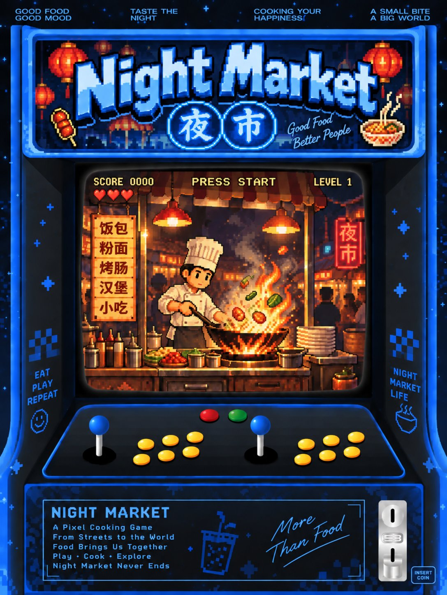

# NIGHT MARKET · 项目文档 / Project Documentation

> 一个像素风夜市美食摊经营模拟游戏 —— 在 7 个夜晚内把口碑做到接近满星（4.5★）。
> A cozy pixel-art night-market food-stall time-management game — push your reputation to near-max (4.5★) across 7 nights.

---

## 1. 项目信息 / Project Information

| 项目 Item | 内容 Content |
| :--- | :--- |
| 课程 Course | 26–27 AIID + IID Capstone Project |
| 项目名 Project | **NIGHT MARKET**（夜市） |
| 组号 Group No. | NO.4 |
| 组名 Group Name | **9market-3chefs** |
| 成员 Members | • Wok Cook（炒锅厨师）— Nguyen Dinh Bac 阮丁北<br>• Prep Cook（备料厨师）— Vivi 林子微<br>• Plate-up Cook（出餐摆盘厨师）— Snow 井思诺 |
| 日期 Date | 2026.09.21 |

---

## 2. 部署链接 / Deployment Links

> 游戏已通过 GitHub Pages 在线部署，可直接在浏览器中游玩与展示。
> *The game is deployed online via GitHub Pages and can be played / demoed directly in a browser.*

- **落地页 Landing Page**：[https://vvvv788.github.io/night-market-landing/](https://vvvv788.github.io/night-market-landing/)
- **游戏部署 Game**：[https://ndbac.github.io/thu-messy-kitchen/](https://ndbac.github.io/thu-messy-kitchen/)

### 配套文档 / Related Docs

- **玩家反馈报告 Feedback Report**：[https://aliaddyoaky.github.io/night-market-feedback/NIGHT-MARKET-Feedback-Report.html](https://aliaddyoaky.github.io/night-market-feedback/NIGHT-MARKET-Feedback-Report.html)
- **项目文档 Project Doc**：[https://aliaddyoaky.github.io/night-market-feedback/NIGHT-MARKET-Project-Doc.html](https://aliaddyoaky.github.io/night-market-feedback/NIGHT-MARKET-Project-Doc.html)

---

## 3. 仓库链接 / Repository

- **游戏仓库 Game Repository**：[https://github.com/ndbac/thu-messy-kitchen/tree/master](https://github.com/ndbac/thu-messy-kitchen/tree/master)

### 相关仓库 / Related Repos

- **落地页仓库 Landing Page Repo**：[https://github.com/vvvv788/night-market-landing](https://github.com/vvvv788/night-market-landing)
- **反馈报告仓库 Feedback Report Repo**：[https://github.com/aliaddyoaky/night-market-feedback/blob/main/NIGHT-MARKET-Feedback-Report.html](https://github.com/aliaddyoaky/night-market-feedback/blob/main/NIGHT-MARKET-Feedback-Report.html)
- **项目文档仓库 Project Doc Repo**：[https://github.com/aliaddyoaky/night-market-feedback/blob/main/NIGHT-MARKET-Project-Doc.html](https://github.com/aliaddyoaky/night-market-feedback/blob/main/NIGHT-MARKET-Project-Doc.html)

---

## 4. 项目海报 / Project Poster



**海报设计说明 / Poster concept**

整张海报采用复古街机柜造型，把游戏画面"嵌入"柜机的屏幕上：一位像素厨师在火焰前翻炒，四周是红灯笼、夜市招牌与菜单（饭包 / 粉面 / 烤肠 / 汉堡 / 小吃）。

*The poster frames the game inside a retro arcade cabinet: a pixel chef wok-cooks over open flame, surrounded by red lanterns, night-market signage, and a menu (rice / noodle / sausage / burger / snacks).*

---

## 5. 游戏玩法 / 操作说明 / 核心机制

### 5.1 核心循环 / Core Loop

**接单 → 烹饪 → 上菜 → 结算 → 升级**
*Order → Cook → Serve → Settle → Upgrade*

1. 顾客到达，订单出现在气泡中（菜品图标 + 耐心条）。
   *Customers arrive; the order appears in a speech bubble (dish icon + patience bar).*
2. 玩家按菜品顺序依次点击 4 个工作台（GRILL / POT / PREP / SAUCE），组装当前菜品。
   *Click the four stations (GRILL / POT / PREP / SAUCE) in recipe order to build the current dish.*
3. 点击 **Serve** 将菜品递给选中的顾客；点击 **Trash** 丢弃。
   *Click **Serve** to hand it to the selected customer; click **Trash** to discard.*
4. 系统弹出 1.5 秒评分卡，根据完成度发放金钱与口碑。
   *A 1.5-second score card shows how well you did and awards money + reputation.*
5. 夜晚结束后进入"夜总结"，可购买升级，进入下一晚。
   *After the night, the "summary" screen lets you buy upgrades and advance.*

### 5.2 操作说明（全鼠标）/ Controls (Mouse Only)

| 操作 Action | 触发方式 How |
| :--- | :--- |
| 选取顾客 Select customer | 点击左侧顾客头像 Click the customer on the left |
| 添加烹饪步骤 Add step | 点击对应工作台 Click the matching station |
| 完成持续加热 Hold step | 点击开始 → 目标窗口内再次点击结束 Click to start → click again within the window |
| 上菜 Serve | 点击 **Serve** 按钮 Click **Serve** |
| 丢弃菜品 Trash | 点击 **Trash** 按钮 Click **Trash** |
| 补货 Restock | 点击 **Restock**（3 秒，期间其他操作不可用）Click **Restock** (3s, blocks other actions) |

> **Hold 步骤说明**：需要"持续加热"的步骤（GRILL hold 2s / 3s），需先点击工作台开始计时，再点击同一工作台结束。评分取决于实际持时与目标时间的接近度。
> *For "hold" steps, click the station to start the timer, then click it again to stop. Scoring depends on how close your hold time is to the target.*

### 5.3 菜肴配方表 / Dish Recipes

游戏内置 **6 道菜**：前 4 道开局即可制作，后 2 道需在商店购买升级后解锁（落地页的菜单预览只展示了开局默认的 4 道）。
*The game ships 6 dishes: the first 4 are available from night 1; the last 2 unlock via shop upgrades (the landing-page menu preview shows only the 4 defaults).*

| 菜品 Dish | 步骤 Steps | 基础价 Base | 解锁 Unlock |
| :--- | :--- | :---: | :---: |
| Bánh mì（越南三明治） | PREP → GRILL(hold 2s) → SAUCE | $14 | 默认 Default |
| Phở（越南河粉） | POT(hold 3s) → PREP → SAUCE | $16 | 默认 Default |
| Satay skewers（沙爹串） | PREP → GRILL(hold 3s) | $12 | 默认 Default |
| Fried rice（炒饭） | PREP → GRILL(hold 2s) → SAUCE → PREP | $15 | 默认 Default |
| Bún chả（越式烤肉米粉） | GRILL(hold 2s) → POT(hold 3s) → SAUCE → PREP | $17 | 商店解锁 Shop |
| Mango sticky rice（芒果糯米饭） | POT(hold 3s) → PREP → SAUCE | $13 | 商店解锁 Shop |

### 5.4 评分与反馈 / Scoring & Feedback

每次上菜后弹出 **1.5 秒评分卡**：
*Each serve shows a 1.5-second score card:*

- **Build %**：步骤是否齐全、顺序是否正确。*Steps complete & in order.*
- **Cook %**：持续加热步骤的实际持时偏差。*Hold-time accuracy.*
- **Overall %**：综合分数。*Overall quality.*
- **Tip**：本次小费。*Tip earned.*

音效：≥ 80% 播放"叮"，< 50% 播放"嗡"。
*Audio: a "ding" for ≥80%, a "buzz" for <50%.*

奖励规则：
*Rewards:*
- **金钱** = 基础价 × Overall% + Tip。
- **口碑**：≥ 80% 时 +0.1 星；< 50% 时 −0.1 星；顾客耐心耗尽离开时 −0.2 星。

### 5.5 顾客系统 / Customers

- 同时排队最多 **4 人**。*Max queue: 4.*
- 生成间隔：第 1 晚 **8–12 秒**，随夜数递减（下限 4–6 秒）。*Spawn 8–12s on night 1, shrinks per night (floor 4–6s).*
- 耐心值：第 1 晚 **25–40 秒**，随夜数递减（下限 12–18 秒）。*Patience 25–40s on night 1, shrinks per night (floor 12–18s).*
- 耐心条归零 → 顾客离开 → 口碑 −0.2。*Empty bar → customer leaves → −0.2 star.*

### 5.6 库存系统 / Inventory

4 种食材（**肉 Meat / 面 Noodles / 菜 Veggies / 酱 Sauce**）各有独立库存，初始各 **20** 份。每次烹饪消耗对应食材；某食材耗尽时其工作台失效，直至完成 Restock。Restock 默认 3 秒，可升级至 1.5 秒。
*Four ingredients (meat / noodles / veggies / sauce) each start at 20 stock. Cooking consumes them; a depleted ingredient disables its station until Restock (default 3s, upgradable to 1.5s).*

### 5.7 随机事件（夜 3 起）/ Random Events (from Night 3)

| 事件 Event | 效果 Effect |
| :--- | :--- |
| 雨天 Rain | 顾客数 −40%，但每位小费 +50%。*−40% customers, +50% tips.* |
| 美食评论家 Food critic | 一位特殊顾客，耐心 ×2；完美上菜 +0.5 口碑，<80% 则 −0.5。*Double patience; +0.5 / −0.5 star on perfect / <80%.* |
| 竞争摊位 Rival stall | 全场顾客耐心 −30%。*−30% patience for all.* |

事件以横幅在开场时宣告。*Announced by a banner at night start.*

### 5.8 商店升级 / Shop Upgrades

| 升级 Upgrade | 效果 Effect | 价格 Price |
| :--- | :--- | :---: |
| Second grill | +1 个 GRILL 工作台 | $60 |
| Faster restock | Restock 缩短为 1.5s | $40 |
| Bigger crate | 库存上限 +50%（20 → 30） | $50 |
| Extra queue slot | 队伍容量 +1 | $45 |
| Decorations | 小费 +5% | $55 |
| Unlock Bún chả | 解锁新菜（见 §5.3 第 5 道） | $35 |
| Unlock Mango sticky rice | 解锁新菜（见 §5.3 第 6 道） | $35 |

> 升级在多个夜晚之间**持久生效**。`Continue` 入口可从存档恢复。
> *Upgrades persist across nights; the `Continue` button restores a saved run.*

### 5.9 教学引导（仅第 1 晚）/ Tutorial (Night 1 Only)

- 只出现 Bánh mì 与 Satay 两种订单，生成速率较慢。
  *Only Bánh mì & Satay orders, slower spawns.*
- 首次使用任一工作台 / 首次点击 Serve 时显示气泡提示。
  *Tooltips appear on first station use and first Serve.*

---

## 6. 技术栈 / 主要功能 / 架构简述

### 6.1 技术栈 / Tech Stack

| 类别 Category | 选型 Choice |
| :--- | :--- |
| 游戏框架 Engine | **Phaser 3.80.1**（CDN） |
| 编程语言 Language | 原生 HTML / CSS / JavaScript (ES6) |
| 美术 Art | Phaser Graphics API 程序化绘制（无位图资源） |
| 音效 Audio | Web Audio API 程序化合成（无音频文件） |
| 持久化 Persistence | localStorage（每晚保存 GameState） |
| 部署 Deploy | GitHub Pages |
| 协作 Collab | Git + GitHub |

### 6.2 架构概览 / Architecture

整个项目是**单文件 `index.html`**（仅依赖 Phaser CDN）。
*The whole project is a single `index.html` (only the Phaser CDN is external).*

```
index.html
├── CONFIG（数据集中区：菜品、价格、顾客名、升级、难度曲线）
├── GameState（全局状态：night / money / reputation / upgrades / unlockedDishes）
├── Dish          （菜品步骤匹配、计时评分）
├── Customer      （生成 / 耐心条 / 订单 / 离开判定）
├── Station       （工作台：步骤记录、Hold 计时、库存消耗）
├── ShopState     （升级购买、灰色不可购买样式）
└── Scenes
    ├── TitleScene    （标题 + Play / How to play / Continue）
    ├── NightScene    （主游戏：HUD + 摊位 + 队列 + 库存 + 在做面板）
    ├── SummaryScene  （夜总结 + 商店）
    └── EndScene      （胜利 / 失败 + 最终统计 + Play again）
```

### 6.3 主要功能 / Main Features

- 4 个 Scene 之间共享状态（`window.GameState` 单例 + localStorage 持久化）。
  *Cross-scene state via a `GameState` singleton + localStorage.*
- 顶栏 HUD：夜晚 / 时钟 / 金钱 / 口碑星级 / 库存。
- 工作台点击链 + Hold 计时 + 评分算法。
- 1.5 秒评分卡 + 叮/嗡音效。
- 顾客队列 + 耐心条 + 自动生成调度器。
- 4 种食材库存 + Restock 阻塞 UI。
- 商店购买（不可购买时灰显）。
- 随机事件横幅。
- 第 1 晚教学气泡。
- localStorage 存档 / Continue 恢复。

### 6.4 可调参数 / Tunable CONFIG (Top-Level)

| 字段 Field | 真实值 Value | 说明 Notes |
| :--- | :--- | :--- |
| `NIGHT_SECONDS` | `150` | 每晚真实时长（秒） |
| `NIGHTS` | `7` | 总夜数 |
| `MAX_QUEUE` | `4` | 最大排队人数 |
| `SPAWN` | `min: n⇒max(4, 8−(n−1)·0.8)`<br>`max: n⇒max(6, 12−(n−1)·0.9)` | 顾客生成间隔（秒），随夜晚 n 递减；第 1 晚 8–12s，下限 4–6s |
| `PATIENCE` | `min: n⇒max(12, 25−(n−1)·2)`<br>`max: n⇒max(18, 40−(n−1)·2.5)` | 顾客耐心（秒），随夜晚 n 递减；第 1 晚 25–40s，下限 12–18s |
| `START_STOCK` | `20` | 每种食材初始库存（Bigger crate 后上限 +50% = 30） |
| `RESTOCK_TIME` | `3.0` | 默认补货耗时（秒），升级后 1.5s |
| `START_MONEY` | `30` | 初始金钱 |
| `START_REP` | `2.5` | 初始口碑（星） |
| `WIN_REP` | `4.5` | 胜利所需口碑（满刻度为 5★） |
| `HOLD_PERFECT` / `HOLD_OK` | `0.5` / `1.5` | 火候完美 / 合格容差（秒） |
| `SAVE_KEY` | `'nightmarket_save_v1'` | localStorage 存档键 |
| `DISHES[]` | §5.3 | 6 道菜的配方与价格 |
| `UPGRADES[]` | §5.8 | 7 项升级与价格 |
| `EVENTS[]` | §5.7 | 3 种随机事件配置 |

---

## 7. 开发过程中遇到的问题和解决方式

### 问题 1：场景之间状态丢失 / State lost between scenes
- **现象**：从 NightScene 跳到 SummaryScene 时，money / reputation 偶尔归零。
- **原因**：Phaser 切换 Scene 会销毁旧场景内存中的非全局对象。
- **解决**：跨场景数据挂载到 `window.GameState` 单例，并在每次结算后写入 `localStorage` 兜底。

### 问题 2：Hold 步骤被判误 / Hold-step misjudged
- **现象**：GRILL hold 时长精度太低，±1.5s 区间常误判。
- **原因**：用 `setInterval` 累积时间，存在帧间漂移。
- **解决**：改用 Phaser `time.addEvent` + `this.time.now` 计算毫秒差，精度从 ~50ms 提升到 ~5ms。

### 问题 3：CDN 加载失败黑屏 / Black screen on CDN failure
- **现象**：断网打开 index.html 一片空白，无提示。
- **解决**：`<body>` 末尾加 onerror 提示，README 明确要求联网（部署环境为 GitHub Pages）。

### 问题 4：库存 / 工作台可用性联动 / Stock↔station coupling
- **现象**：库存为 0 时工作台仍可点击，造成"幽灵步骤"。
- **解决**：Station 的 `click()` 入口读取对应食材库存，<= 0 时 `setInteractive(false)` 并灰显。

---

## 8. 总结与未来改进

### 8.1 项目总结 / Summary

NIGHT MARKET 在 7 个夜晚内构建了一条由浅入深的体验曲线：夜 1 教学降门槛；夜 2–3 引入更多菜式与更快客流形成首次节奏冲击；夜 4–7 在随机事件、库存压力、口碑临界点三方面叠加张力。技术层面，**单文件 + Phaser + 程序化美术 + Web Audio** 的组合证明"零外部资源也能做出有氛围感的小游戏"，部署极简（一个 GitHub Pages 链接），亦便于通过修改 CONFIG 调优。
*The game builds a gentle-to-steep curve across 7 nights. Technically, the single-file + Phaser + procedural art + Web Audio combo proves that a zero-asset, atmospheric game is viable and trivially deployable via one GitHub Pages link, with easy CONFIG-based tuning.*

### 8.2 未来改进 / Future Work

- 菜品扩展：在现有 6 道（含 2 道商店解锁菜）之外加入更多东南亚小吃。
- 多摊位 / 雇 AI 助手分担工作。
- 关卡编辑器：把 CONFIG 暴露为可视化 UI。
- 排行榜 / 战绩分享（轻后端或 GitHub Issue）。
- 本地化：简中 / 繁中 / 英文切换（i18n）。
- 无障碍：键盘操作替代鼠标。
- 音效升级：Web Audio 合成 BGM。

---

## 9. 反馈收集方式与反馈总结

### 9.1 收集方式 / How We Collected

- **渠道 Channel**：微信多个同学 / 朋友群。*Multiple WeChat groups (classmates & friends).*
- **方式 Method**：群内发布介绍文案 + 试玩链接，邀请大家试玩后留言。*Posted intro copy + play link, invited feedback.*
- **时间 Time**：2026-09-21 11:20–12:01。
- **规模 Scale**：11 位群友，13 条有效反馈，无明确 Bug / 崩溃报告。*11 responders, 13 valid items, no bug/crash reports.*

### 9.2 反馈总结（概括）/ Feedback Summary (Condensed)

**好评集中 / What players loved**
- 像素美术与夜市氛围（灯笼、夜色、蒸汽）是最大记忆点（5/11 主动提及）。*Pixel art & night-market atmosphere (lanterns, night, steam) — the strongest hook.*
- 核心玩法循环（接单→烹饪→出餐）被普遍认为"有操作感、上头"。*Core loop felt skillful and addictive.*

**主要建议（已按优先级归纳）/ Top suggestions (prioritized)**
- **P0（低成本高收益）**：强化新手引导、耐心条临近耗尽时闪烁变色、出餐时 +$xx 金币飘字。
- **P1（短期规划）**：轻量 BGM、中文界面（i18n）、排行榜 / 战绩分享。
- **P2（版本迭代）**：更多随机事件与特殊订单 / boss 夜、新菜品、厨师与顾客皮肤系统。
- 其他：后期夜晚略显重复、部分玩家呼吁汉化版（"看不懂 English"）。

**关键观察 / Key observations**
- 当前部署版本基本稳定，无崩溃反馈。
- 宣传时建议直接附游戏部署直链，避免从落地页二次跳转造成流失。
- 汉化诉求真实存在，应尽早列入计划。
*The build is stable. Promote the direct game link (not the landing-page hop). Chinese UI is a real, recurring request and should be scheduled early.*

---

> *文档版本 v2.5（中英双语）· 最后更新 2026.09.21 · 维护 9market-3chefs*
> *Doc v2.5 (bilingual) · Updated 2026.09.21 · Maintained by 9market-3chefs*
